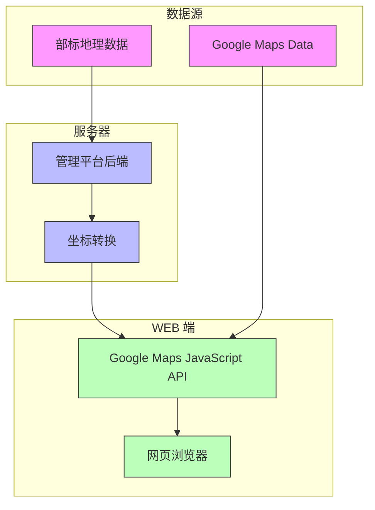
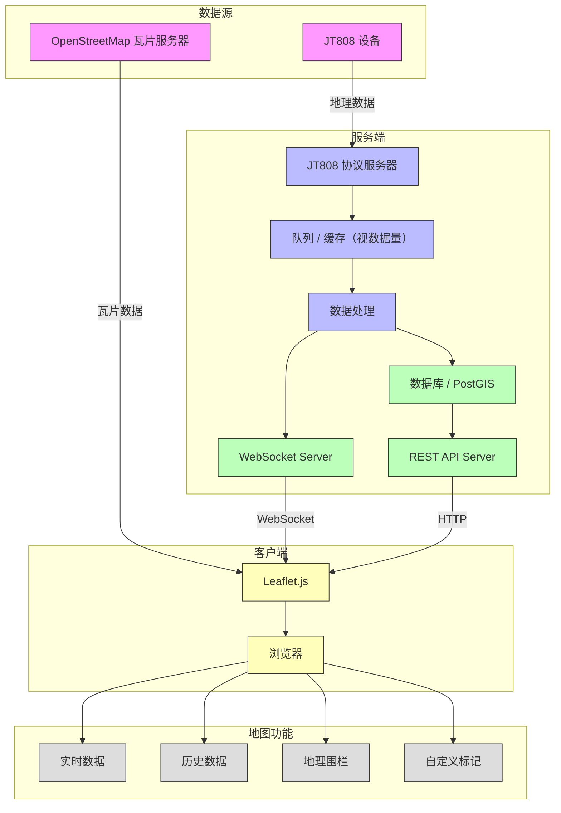

# 车辆追踪与监控管理平台 - 地图

## GPS 坐标偏移问题

引用自[百度地图开放平台](https://lbs.baidu.com/index.php?title=jspopularGL/guide/coorinfo)

> 
    目前国内主要有以下三种坐标系：

    WGS84：为一种大地坐标系，也是目前广泛使用的GPS全球卫星定位系统使用的坐标系。

    GCJ02：又称火星坐标系，是由中国国家测绘局制订的地理信息系统的坐标系统。由WGS84坐标系经加密后的坐标系。

    BD09：为百度坐标系，在GCJ02坐标系基础上再次加密。其中bd09ll表示百度经纬度坐标，bd09mc表示百度墨卡托米制坐标。

    非中国地区地图，服务坐标统一使用WGS84坐标。

相关资料：

- [Restrictions on geographic data in China - Wikipedia](https://en.wikipedia.org/wiki/Restrictions_on_geographic_data_in_China#GPS_shift_problem)

- [A Short Guide To The Chinese Coordinate System. GCJ-02(gcj 02) Explained(https://abstractkitchen.com/blog/a-short-guide-to-chinese-coordinate-system/)

- [wandergis/coordtransform: 提供了百度坐标（BD09）、国测局坐标（火星坐标，GCJ02）、和WGS84坐标系之间的转换](https://github.com/wandergis/coordtransform)

### 实现

- 使用地图服务

- 使用 OpenStreetMap

## 价格

高德 ¥ 50,000 https://lbs.amap.com/upgrade#business

百度 ¥ 50,000 https://lbs.baidu.com/cashier/auth

## 参考

- [WebGIS Development in 2023: A Guide to the Tools and Technologies I Use for Building Advanced Geospatial Applications](https://opensourcegisdata.com/webgis-development-2023-guide-tools-technologies-for-building-advanced-geospatial-applications.html)

- [百度地图 API SDK](https://lbs.baidu.com/index.php?title=jspopularGL/guide/helloworld)

- [静态地图 | 高德地图API](https://lbs.amap.com/api/webservice/guide/api/staticmaps/)