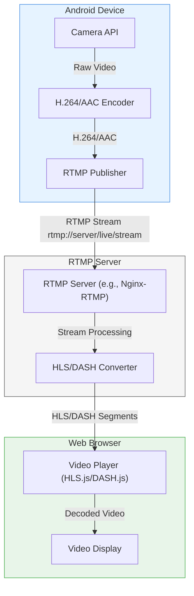
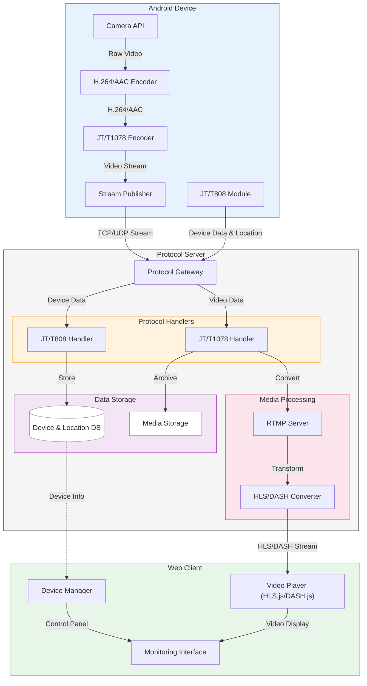

# 车辆追踪与监控管理平台 - 实时监控

- [车辆追踪与监控管理平台 - 实时监控](#车辆追踪与监控管理平台---实时监控)
  - [基本概念](#基本概念)
  - [云解决方案](#云解决方案)
    - [腾讯云](#腾讯云)
    - [阿里云](#阿里云)
    - [AWS](#aws)
  - [开源项目](#开源项目)
  - [组件](#组件)
    - [FFmpeg](#ffmpeg)
  - [架构](#架构)
    - [普通的流媒体推流播放架构](#普通的流媒体推流播放架构)
    - [含部标协议的架构](#含部标协议的架构)
- [参考](#参考)

## 基本概念

- JT/T808 
  
  车辆卫星定位系统与监管/监控平台的通信协议

- JT/T1078

    车载终端与监控平台的音视频通信协议

- 推流

    推流是把采集阶段封装好的音视频直播流推送到云直播服务中心的过程。

- 拉流

    拉流是将第三方直播流地址拉取到直播中心进行 CDN 内容分发，推流至需要的节点的过程。

- 播流

    播流是将直播服务中心已有直播内容，分发到播放器进行播放过程。

## 云解决方案

尚无发现匹配部标的一站式解决方案

### 腾讯云

- [慢直播](https://cloud.tencent.com/document/product/267/44250)

	- 支持 GB28181 国标摄像头和 RTMP 协议
	- 配套 web 播放器，基础版授权（免费）就够用

### 阿里云

- [RTMP推流上传](https://help.aliyun.com/zh/oss/user-guide/rtmp-based-stream-ingest)

	- 仅支持 JT/T 808

### AWS

- [Live Streaming on AWS with Amazon S3](https://docs.aws.amazon.com/solutions/latest/live-streaming-on-aws-with-amazon-s3/features-and-benefits.html)

## 开源项目

由于部标是国内的一个标准，网上的资料相对较少，但还是有一些开源项目可供使用

主要就是让一台设备支持1078协议，在接收特定指令后，通过该协议向服务器推送音视频数据，服务器再将数据转发到客户端或网页播放器，让用户能够观看设备发送的数据。

协议的编程实现只需要按文档读取数据，并不需要直接处理音视频编码。

- 基于 Spring-Boot 的 JT-808 协议服务端 [jt-framework](https://github.com/hylexus/jt-framework)

	- 1078 开发中

- [JT808协议服务端](https://gitee.com/yezhihao/jt808-server)

    - 支持Android客户端编解码

- [jt1078 · GitHub Topics](https://github.com/topics/jt1078)

## 组件

### FFmpeg

> 为什么使用设备端编码 ？
>
> - 大多数 Android 设备都有专用的硬件编码器 (MediaCodec)
> - 更好的电池效率
> - 更低的带宽
> - 更低的延迟
> - 降低服务器基础设施成本
>
> 设备端：
> - 使用 MediaCodec 进行 H.264/H.265 编码
> - 通过 HW+ 配置文件进行硬件加速
> - 根据网络条件自适应比特率
> - 支持多种分辨率 (720p/1080p)
> - 考虑电池电量以进行质量调整
>
> 服务器端：
> - 专注于流管理
> - 针对特定需求的可选转码
> - 流录制和存储
> - 流分发/CDN 集成

## 架构

### 普通的流媒体推流播放架构

1. Android 设备端：

    - 相机 API 捕获原始视频
    - 编码​​器转换为 H.264/AAC 格式
    - 将流发送到服务器

2. 服务器端：

    - RTMP 服务器（如 Nginx-RTMP）接收流
    - 转换为 HLS/DASH 以进行网络播放

3. 浏览器端：

   - 视频播放器（使用 HLS.js 或 DASH.js）接收片段
   - 向观看者显示视频

### 含部标协议的架构

JT/T808 集成

- 处理位置报告、设备状态
- 提供终端身份验证

JT/T1078 功能：

- 视频和音频通道管理
- 视频质量参数

服务器架构：

- 协议网关处理 JT/T808 和 JT/T1078 流量
- 使用单独的程序处理每个协议
- 集成媒体处理
- 设备数据和媒体档案的数据库存储

客户端功能：

- 组合监控界面
- 设备管理功能
- 视频播放集成
- 实时控制选项

# 参考

- [ICS 03.220.20;35.240.60 M53 - 中华人民共和国交通运输部](https://www.mot.gov.cn/yijianzhengji/201706/P020170629514064508301.pdf)

- [JT/T 1078-2016 协议文档](https://github.com/yezhihao/jt808-server/blob/master/%E5%8D%8F%E8%AE%AE%E6%96%87%E6%A1%A3/JTT%201078-2016.pdf)

- [推流、拉流与播流](https://help.aliyun.com/zh/live/stream-ingest-stream-pulling-and-streaming)

- [JT1078协议开发之实时视频后记](https://catinsides.github.io/2019/03/16/JT1078%E5%8D%8F%E8%AE%AE%E5%BC%80%E5%8F%91%E4%B9%8B%E5%AE%9E%E6%97%B6%E8%A7%86%E9%A2%91%E5%90%8E%E8%AE%B0/)

