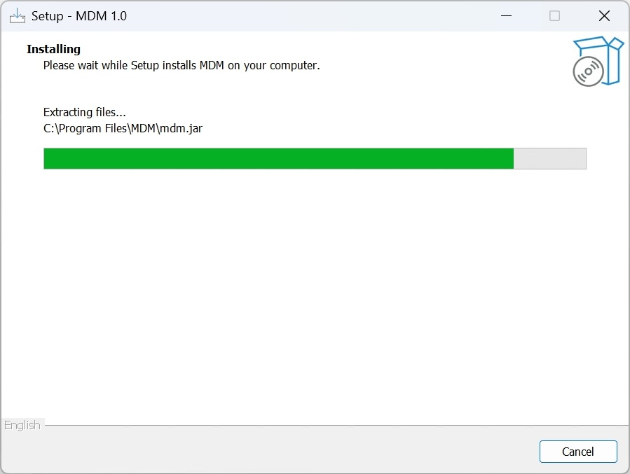

# 📘 Installation guide

## 📁 1. Before You Begin

* Close all unnecessary applications to avoid conflicts during installation
* Ensure your system has the necessary permissions (you may need admin access)

## 🚀 2. Launching the Installer

1. Locate the downloaded .exe file (typically in the Downloads folder)
2. Double-click the file to start the installer
3. If prompted by User Account Control (UAC), click Yes to allow the installer to run

## ⚙️ 3. Common Installation Steps

### Step 1: Select language

* Choose your preferred language from the dropdown menu
* Click "OK" to continue

### Step 2: Welcome Screen

* Read introductory information
* Click "Next" or "Continue"

### Step 3: Choose Installation Folder

* Default folder is usually fine (e.g., C:\Program Files\MDM)
* To change it, click "Browse…" and select another location
* Click "Next"

### Step 4: Create Start Menu folder

* Decide whether to create a Start Menu folder
* Check/uncheck boxes as needed
* Click "Next"

### Step 5: Create Desktop Shortcuts

* Decide whether to create a desktop icon
* Check/uncheck boxes as needed
* Click "Next"

### Step 6: Ready to Install

* Review your selections
* Click "Install" to begin

### Step 7: Installation Progress

* Wait for the installation to complete. Do not shut down or restart

### Step 8: Completion

* Check "Launch MDM" if you want to start it right away
* Click "Finish"

## 🧹 4. After Installation

* Open the app from the Start Menu, desktop shortcut, or installation directory

## 🛠️ 5. Troubleshooting

* Installer won’t open: Right-click the "mdm-launcher.exe" file and choose "Run as administrator"
* Error message appears: Note the error and contact support