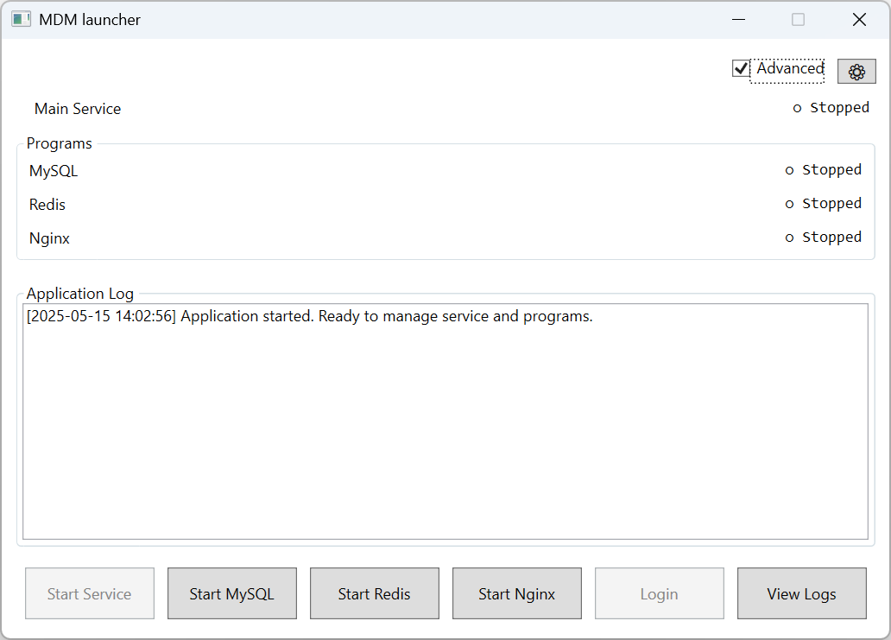
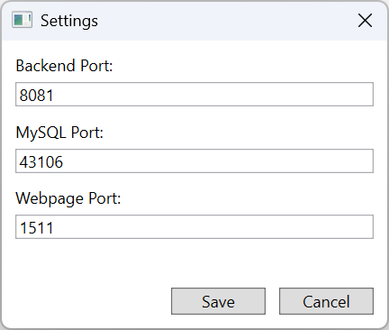
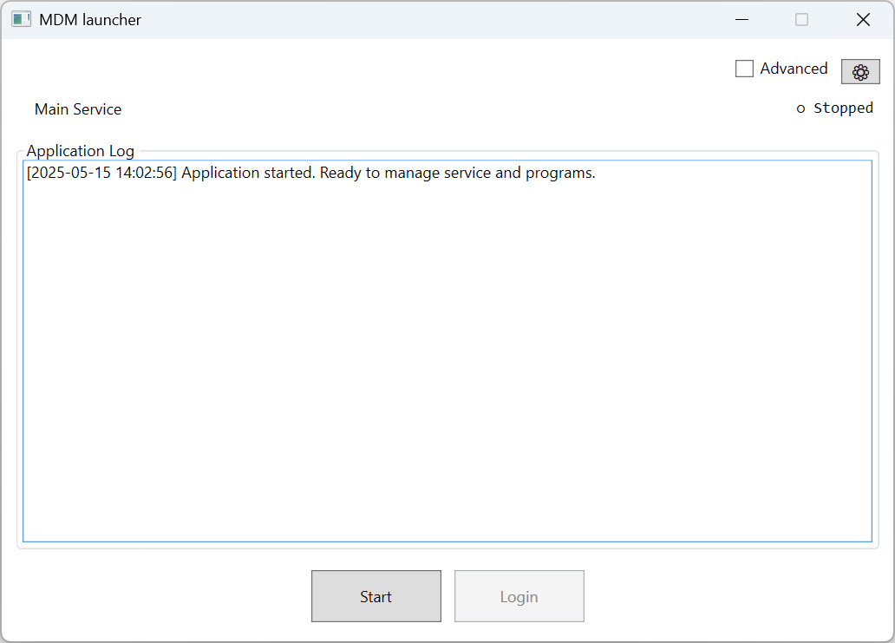
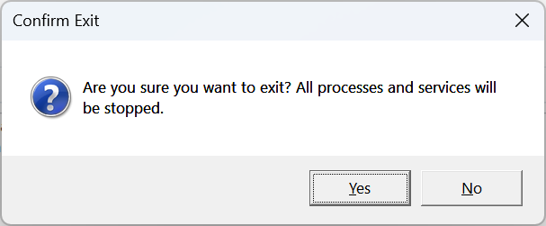

# 🚀 MDM Launcher

This document provides an overview of the MDM Launcher application interface, explaining its components and functionality.

## 📖 Overview

The `MDM Launcher` is a software tool for managing services and programs in the MDM desktop version. It allows users to start, stop, and monitor the status of various components.

## 🧩 Components

### 1. Header Section
- **Advanced Checkbox**: Toggles the visibility of advanced controls for individual programs and services.
- **Settings Button (⚙)**: Opens the settings dialog to configure application settings.

### 2. Service Section
- Shows the main service (`MDMService`) is running (`● Running`) or stopped (`○ Stopped`)

### 3. Programs Section

**Programs GroupBox**: Contains the status and controls for individual programs.
  - **MySQL**: Displays and manages the MySQL service.
  - **Redis**: Displays and manages the Redis process.
  - **Nginx**: Displays and manages the Nginx process.

::: info
This section is visible only when the "Advanced" checkbox is selected.
:::

### 4. Log Output Section
- **Application Log**: Displays real-time logs for all actions and processes.
- **ScrollViewer**: Enables scrolling through the log history.

### 5. Control Buttons
- **Start/Stop All**: Starts or stops all services and programs simultaneously.
- **Login**: Opens the MDM web interface (enabled when all components are running).
- **View Logs**: Opens the logs folder.

When "Advanced" is selected, additional controls become available:
- **Start / Stop Service**: Manages the main service.
- **Start / Stop MySQL**: Manages the MySQL service.
- **Start / Stop Redis**: Manages the Redis process.
- **Start / Stop Nginx**: Manages the Nginx process.

::: info
Individual controls are only available in advanced mode.
:::

::: warning
Stopping MySQL or Redis will automatically stop the main service, as it depends on these components for proper operation.
:::

### 6. Settings Dialog
The `Settings Dialog` allows users to configure essential application settings, such as ports for backend services and the web interface.

1. Click the **Settings Button (⚙)** to open the settings dialog.
2. Modify the configuration as needed.
3. Update the **Backend Port**, **MySQL Port**, or **Webpage Port** as required.
4. Click **Save** to apply the changes. The application will restart the services.

::: warning
Ensure all components are stopped before making configuration changes.
:::

## 🔧 Usage

### 🟢 Starting All Components
1. Click the **Start** button to start all services and programs.
2. Monitor progress using the **Application Log**.
3. Once all components are running, the **Login** button will be enabled.

### ⚙️ Managing Individual Components
1. Select the **Advanced** checkbox to reveal individual controls.
2. Use the respective buttons to start or stop MySQL, Redis, or Nginx.

### 📋 Viewing Logs
1. Click the **View Logs** button to open the logs folder.
2. Review the logs for detailed information about the application's operations.

### 🚪 Exiting the Application
1. If any components are running, you will be prompted to confirm the exit.
2. Choose "Yes" to stop all components and exit, or "No" to cancel.

