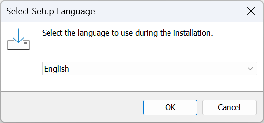
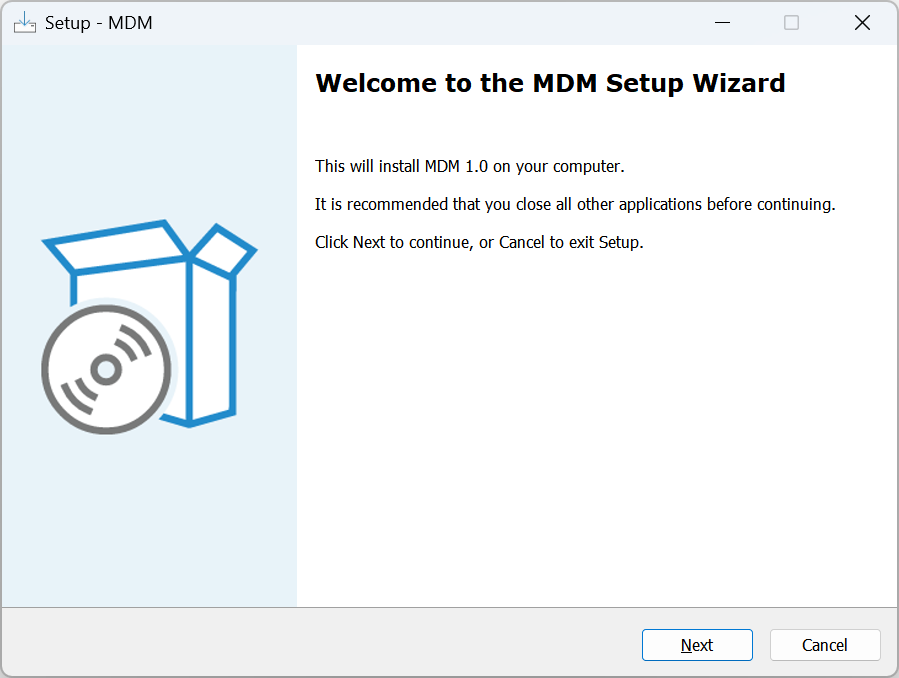
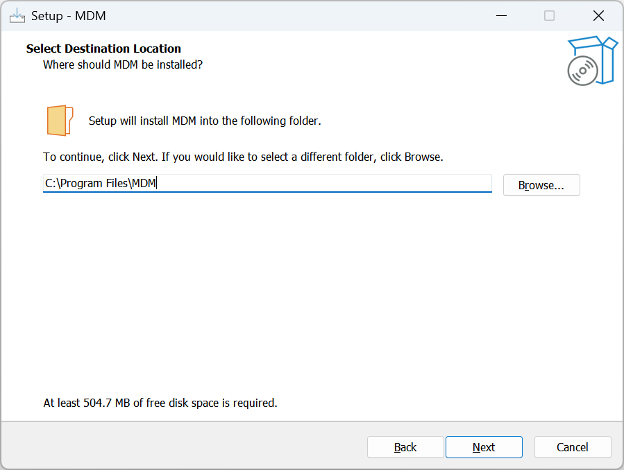
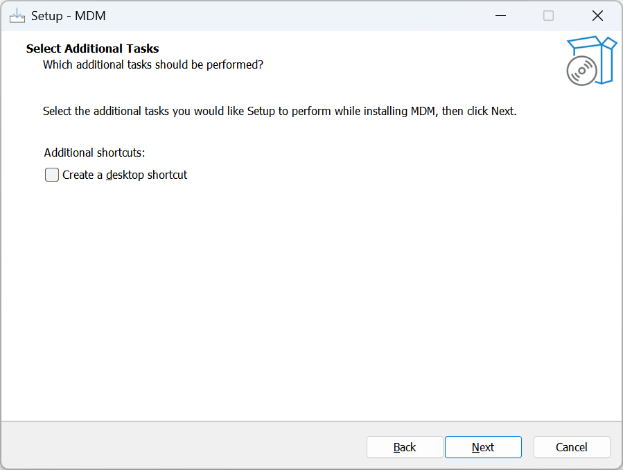
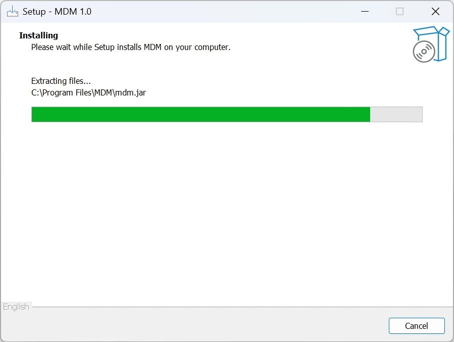
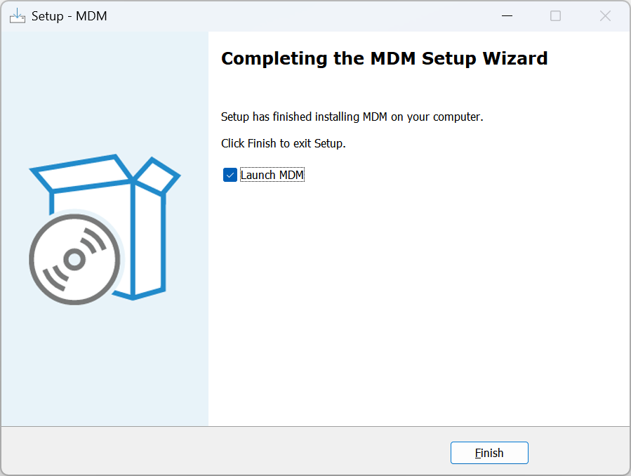

# 📘 安装指南

## 📁 开始之前

- 关闭所有不必要的应用程序以避免安装时发生冲突
- 确保您的系统具有必要的权限（可能需要管理员权限）

## 🚀 启动安装程序

- 找到已下载的 .exe 文件
- 双击该文件以启动安装程序
- 如果出现用户账户控制（UAC）提示，请点击“是”以允许安装程序运行

## ⚙️ 常见安装步骤

### 第一步：选择语言

- 从下拉菜单中选择您的首选语言
- 点击“确定”继续

### 第二步：欢迎界面

- 阅读介绍信息
- 点击“下一步”或“继续”

### 第三步：选择安装文件夹

- 默认文件夹通常可以使用（例如：C:\Program Files\MDM）
- 如果需要更改，请点击“浏览...”并选择其他位置
- 点击“下一步”

### 第四步：创建开始菜单文件夹

- 决定是否创建开始菜单文件夹
- 根据需要勾选/取消勾选选项
- 点击“下一步”

### 第五步：创建桌面快捷方式

- 决定是否创建桌面图标
- 根据需要勾选/取消勾选选项
- 点击“下一步”

### 第六步：准备安装

- 检查您的选择
- 点击“安装”开始

### 第七步：安装进度

- 等待安装完成。请勿关闭或重启电脑

### 第八步：完成

- 如果您希望立即启动 MDM，请勾选“启动 MDM”
- 点击“完成”

## 🧹 安装后

- 从开始菜单、桌面快捷方式或安装目录打开应用程序

## 🛠️ 故障排除

- 安装程序无法打开：右键点击 “mdm-launcher.exe” 文件并选择【以管理员身份运行】
- 出现错误信息：记录错误并联系支持