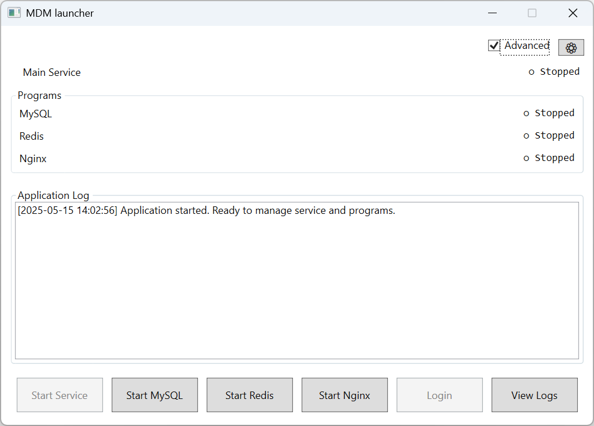
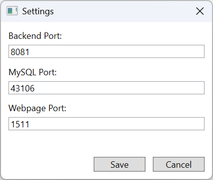
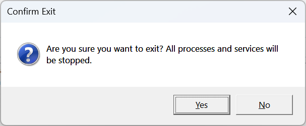

# 🚀 MDM 启动器

本文档概述了 MDM 启动器应用程序界面，解释其组件和功能。

## 📖 概述

`MDM 启动器` 是一个用于管理 MDM 桌面版中服务和程序的软件工具。它允许用户启动、停止和监控各种组件的状态。

## 🧩 组件

### 1. 头部区域
- **高级复选框**：切换单个程序和服务的高级控件的可见性。
- **设置按钮 (⚙)**：打开设置对话框以配置应用程序设置。

### 2. 服务区域
- 显示主服务 (`MDMService`) 的运行状态 (`● 运行中`) 或停止状态 (`○ 已停止`)

### 3. 程序区域

**程序分组框**：包含单个程序的状态和控件。
  - **MySQL**：显示和管理 MySQL 服务。
  - **Redis**：显示和管理 Redis 进程。
  - **Nginx**：显示和管理 Nginx 进程。

::: info
此部分仅在选中“高级”复选框时可见。
:::

### 4. 日志输出区域
- **应用程序日志**：显示所有操作和进程的实时日志。
- **滚动查看器**：支持滚动查看日志历史记录。

### 5. 控制按钮
- **启动/停止全部**：同时启动或停止所有服务和程序。
- **登录**：打开 MDM 网页界面（当所有组件运行时启用）。
- **查看日志**：打开日志文件夹。

当选择“高级”时，会显示其他控件：
- **启动 / 停止服务**：管理主服务。
- **启动 / 停止 MySQL**：管理 MySQL 服务。
- **启动 / 停止 Redis**：管理 Redis 进程。
- **启动 / 停止 Nginx**：管理 Nginx 进程。

::: info
单个控件仅在高级模式下可用。
:::

::: warning
停止 MySQL 或 Redis 会自动停止主服务，因为主服务依赖这些组件正常运行。
:::

### 6. 设置对话框
`设置对话框` 允许用户配置关键的应用程序设置，例如后端服务和网页界面的端口。

1. 点击 **设置按钮 (⚙)** 打开设置对话框。
2. 根据需要修改配置。
3. 更新 **后端端口**、**MySQL 端口** 或 **网页端口**。
4. 点击 **保存** 应用更改。应用程序将重新启动服务。

::: warning
确保在进行配置更改之前停止所有组件。
:::

## 🔧 使用方法

### 🟢 启动所有组件
1. 点击 **启动** 按钮启动所有服务和程序。
2. 使用 **应用程序日志** 监控进度。
3. 当所有组件运行后，**登录** 按钮将启用。

### ⚙️ 管理单个组件
1. 选择 **高级** 复选框以显示单个控件。
2. 使用相应的按钮启动或停止 MySQL、Redis 或 Nginx。

### 📋 查看日志
1. 点击 **查看日志** 按钮打开日志文件夹。
2. 查看日志以获取有关应用程序操作的详细信息。

### 🚪 退出应用程序
1. 如果有任何组件正在运行，系统会提示确认退出。
2. 选择“是”以停止所有组件并退出，或选择“否”以取消。

